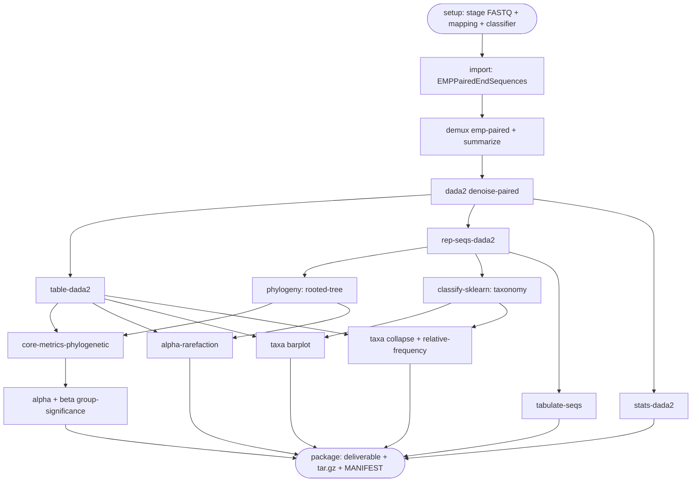

# Pipeline Reference

Technical reference for the QIIME 2 16S rRNA amplicon pipeline driven by
[`scripts/qiime-console.py`](../scripts/qiime-console.py). This is the shared
source of truth for the pipeline flow, the tools it runs, and every file it
produces. The audience guides ([PI](PI.md), [USER](USER.md),
[DEVELOPER](DEVELOPER.md), [MAINTAINER](MAINTAINER.md)) link here.

> **Accurate as of commit `e5d3edb`.** The tables below are hand-maintained;
> `scripts/check_docs_tables.py` asserts they stay in sync with the code.

## What the pipeline does

It turns raw, multiplexed Illumina paired-end 16S reads into a taxonomic and
diversity profile of the microbial community in each sample. It follows the
Earth Microbiome Project (EMP) protocol: paired reads plus a separate barcode
(index) read, demultiplexed by a mapping file, denoised into amplicon sequence
variants (ASVs) with DADA2, placed on a phylogenetic tree, classified against a
Greengenes reference, and summarized with alpha/beta diversity.

### Directory contract

Every step reads from `base_dir/input/` and writes to `base_dir/output/`:

```
base_dir/
├── input/
│   ├── raw_data/{forward,reverse,barcodes}.fastq.gz   # staged EMP reads
│   ├── mapping.txt                                     # sample metadata + barcodes
│   └── gg-13-8-99-515-806-nb-classifier.qza            # fetched during setup
└── output/                                             # all artifacts + deliverable
```

After a step writes an artifact to `output/`, `link_output()` creates a symlink
to it back in `input/` (by basename). That is why downstream steps read
intermediates such as `table-dada2.qza`, `rooted-tree.qza`, and `taxonomy.qza`
from `input/` even though they were produced in `output/`.

## Execution order

The order below is the **actual** call order in `run_workflow`, not a logical
regrouping. Two things surprise readers:

1. **Taxonomy/classification runs *before* diversity**, and lives inside the
   misleadingly named `run_phylogeny_analysis()` (which does the tree *and*
   classify-sklearn, taxonomy tabulate, and the taxa barplot).
2. **`alpha-rarefaction` is coded twice but runs once.** It is called in both
   `run_phylogeny_analysis()` and `run_diversity_analysis()` writing the same
   `output/alpha-rarefaction-results/`; phylogeny runs first, so the diversity
   call hits the skip-if-exists guard. The duplicate call is effectively dead.

Execution is sequential (steps run one after another), but the **data flow is a
DAG** — DADA2's outputs fan out, and the tree/table and taxonomy/table pairs
converge downstream:



Branch/converge points: `rep-seqs-dada2` feeds phylogeny, classify-sklearn, and
tabulate-seqs; `table-dada2` feeds core-metrics, alpha-rarefaction, taxa barplot,
feature-table summarize, and taxa collapse; `rooted-tree`+`table` converge into
core-metrics and alpha-rarefaction; `taxonomy`+`table` converge into taxa barplot
and taxa collapse; `package` bundles every exported artifact.

*`run_phylogeny_analysis` contains both `tree` and `tax` (taxonomy runs before
diversity). `alpha-rarefaction` is coded in two functions but runs once (see below).

## Table 1 — Tools & Inputs

One row per QIIME step in execution order. All commands are `qiime <...>` run via
`subprocess.run`. "Source" is where the input artifact is read from.

| Stage | Command | Input(s) & source | Purpose |
|---|---|---|---|
| Import | `tools import` | `input/raw_data/` (forward/reverse/barcodes.fastq.gz) | Wrap raw EMP paired-end reads into a `.qza` artifact |
| Demux | `demux emp-paired` | imported seqs; `input/mapping.txt` (`--m-barcodes-column`, configurable via `--barcode-column-name`) | Split reads per sample by barcode |
| Demux QC | `demux summarize` | `output/demux/demux-full.qza` | Per-sample read counts & quality plots |
| Demux details | `metadata tabulate` | `output/demux/demux-details.qza` | Tabulate barcode error-correction details |
| Demux export | `tools export` | `output/demux/demux-full.qzv` | Unpack the QC viz to browsable HTML (`output/viz/demux-full/`) |
| Denoise | `dada2 denoise-paired` | `demux-full.qza` (from `output/demux/`, legacy flat fallback) | Quality-filter, denoise, dereplicate, chimera-remove → ASV table, rep-seqs, stats |
| Table QC | `feature-table summarize` | `input/table-dada2.qza`; `input/mapping.txt` | Feature-table summary (per-sample/feature counts) |
| Rep-seqs QC (1) | `feature-table tabulate-seqs` | `input/rep-seqs-dada2.qza` | Interactive rep-seq table → **`rep-seqs-dada2.qzv`** (exported) |
| Denoise stats | `metadata tabulate` | `output/stats-dada2.qza` | Tabulate DADA2 filtering/merge/chimera stats |
| Phylogeny | `phylogeny align-to-tree-mafft-fasttree` | `input/rep-seqs-dada2.qza` | MAFFT align → mask → FastTree → rooted/unrooted tree |
| Rep-seqs QC (2) | `feature-table tabulate-seqs` | `input/rep-seqs-dada2.qza` | Second tabulate-seqs → **`rep-seqs.qzv`** (internal) |
| Classify | `feature-classifier classify-sklearn` | `input/gg-13-8-99-515-806-nb-classifier.qza`; `input/rep-seqs-dada2.qza` | Assign taxonomy to each ASV (naive-Bayes) |
| Taxonomy QC | `metadata tabulate` | `output/taxonomy.qza` | Tabulate the taxonomy assignments |
| Taxa barplot | `taxa barplot` | `input/table-dada2.qza`; `output/taxonomy.qza`; `input/mapping.txt` | Interactive stacked taxa bar plots |
| Diversity core | `diversity core-metrics-phylogenetic` | `input/rooted-tree.qza`; `input/table-dada2.qza`; `input/mapping.txt`; `--p-sampling-depth` | Rarefy + all core alpha/beta metrics + PCoA/Emperor |
| Alpha sig. ×3 | `diversity alpha-group-significance` | `core-metrics-results/{faith_pd,shannon,evenness}_vector.qza`; `input/mapping.txt` | Test alpha diversity vs metadata groups |
| Rarefaction | `diversity alpha-rarefaction` | `input/table-dada2.qza`; `input/rooted-tree.qza`; `--p-max-depth`, `--p-steps` | Rarefaction curves (adequacy of sampling depth) |
| Beta sig. | `diversity beta-group-significance` | `core-metrics-results/unweighted_unifrac_distance_matrix.qza`; `input/mapping.txt`; `--m-metadata-column` per `--beta-diversity-group-by` | Test between-group community differences (PERMANOVA) |
| Collapse | `taxa collapse` (levels 1–7) | `input/table-dada2.qza`; `input/taxonomy.qza`; `--p-level` | Collapse ASV table to each taxonomic rank |
| Rel. freq. | `feature-table relative-frequency` | `output/phyla-table.<level>.qza` | Convert collapsed counts to relative abundances |
| Rel. export | `tools export` + `biom convert` | `output/rel-phyla-table.<level>.qza` | Export rel-abundance tables to biom/TSV |

**Non-QIIME inputs the user must provide (or `setup` fetches):**

| Input | Provided by | Notes |
|---|---|---|
| `Undetermined_*_{R1,R2,I1}_*.fastq.gz` | user | bcl2fastq "Undetermined" output; `setup` renames to forward/reverse/barcodes |
| `mapping.txt` | user | Tab-delimited QIIME metadata; must include a barcode column (`BarcodeSequence`) |
| `gg-13-8-99-515-806-nb-classifier.qza` | `setup` (wget) | Greengenes 13-8 515F/806R naive-Bayes classifier, pinned to sklearn-1.4.2 |

## Table 2 — Outputs

`Internal` = intermediate/working product; `Exported` = included in the shared
`deliverable/` bundle (and `.tar.gz`). The Exported set matches `DELIVERABLE_FILES`
+ `DELIVERABLE_DIRS` + `metadata.tsv` + `MANIFEST.txt` in `package_results`.

| Path (under `output/`) | Type | Semantic / content | Class |
|---|---|---|---|
| `paired-end-demux.qza` | .qza | Imported raw EMP paired-end sequences | Internal |
| `demux/demux-full.qza` | .qza | Per-sample demultiplexed reads | Internal |
| `demux/demux-details.qza` | .qza | Barcode error-correction details | Internal |
| `demux/demux-details.qzv` | .qzv | Tabulated error-correction details | Internal |
| `demux/demux-full.qzv` | .qzv | Per-sample read counts & quality QC | **Exported** |
| `viz/demux-full/` | dir | Unpacked HTML of the demux QC viz | Internal |
| `table-dada2.qza` | .qza | ASV feature table (counts per sample) | **Exported** |
| `table-dada2.qzv` | .qzv | Feature-table summary | **Exported** |
| `rep-seqs-dada2.qza` | .qza | Representative ASV sequences (FASTA) | **Exported** |
| `rep-seqs-dada2.qzv` | .qzv | Interactive rep-seq table (lengths, BLAST) | **Exported** |
| `rep-seqs.qzv` | .qzv | Second tabulate-seqs viz (duplicate of above) | Internal |
| `stats-dada2.qza` | .qza | DADA2 denoising stats | **Exported** |
| `stats-dada2.qzv` | .qzv | Tabulated denoising stats | **Exported** |
| `aligned-rep-seqs.qza` | .qza | MAFFT multiple alignment | Internal |
| `masked-aligned-rep-seqs.qza` | .qza | Masked alignment | Internal |
| `unrooted-tree.qza` | .qza | FastTree unrooted phylogeny | Internal |
| `rooted-tree.qza` | .qza | Midpoint-rooted phylogeny (for UniFrac) | **Exported** |
| `taxonomy.qza` | .qza | Per-ASV taxonomic assignments | **Exported** |
| `taxonomy.qzv` | .qzv | Tabulated taxonomy | **Exported** |
| `taxa-bar-plots.qzv` | .qzv | Interactive stacked taxa bar plots | **Exported** |
| `core-metrics-results/` | dir | Rarefied table, alpha vectors, distance matrices, PCoA + Emperor, group-significance | **Exported** (`.qza`+`.qzv` only) |
| `alpha-rarefaction-results/` | dir | Rarefaction-curve visualization | **Exported** (`.qza`+`.qzv` only) |
| `phyla-table.<1-7>.qza` | .qza | ASV table collapsed to each rank | Internal |
| `rel-phyla-table.<1-7>.qza` | .qza | Relative-abundance table per rank | Internal |
| `rel-phyla-table.<1-7>.tsv` | tsv | Exported rel-abundance table (biom→TSV) | Internal |
| `rel-phyla-table-level-<n>/` | dir | Exported biom of each rel-abundance table | Internal |
| `metadata.tsv` | tsv | Sample metadata (copied from `input/mapping.txt`) | **Exported** |
| `deliverable/` | dir | The curated shareable bundle | (the bundle) |
| `deliverable/MANIFEST.txt` | txt | md5 checksums + run info for the bundle | **Exported** |
| `<run>-deliverable.tar.gz` | tar.gz | Archived `deliverable/` | (the bundle) |

### Provenance

Every `.qza`/`.qzv` embeds QIIME 2's full provenance graph (methods, parameters,
plugin/framework versions, and `citations.bib`). Open any `.qzv` at
<https://view.qiime2.org> and read the **Provenance** tab. `MANIFEST.txt` adds
bundle-level md5 checksums. Together these make a shared deliverable reproducible
and self-describing.

## Redundancy — what we deliberately don't ship, and why

QIIME (and the pipeline) emit the same information in several forms. The
deliverable ships **one canonical form of each result** — the sharing rule is
**"vizzes (`.qzv`) + data artifacts (`.qza`), nothing else."** The redundant
forms below stay out of the bundle:

| Redundant form | Canonical form we ship | Why it's excluded |
|---|---|---|
| `viz/demux-full/` (unpacked HTML) | `demux-full.qzv` | The `.qzv` *is* the HTML, zipped + provenance. View it at view.qiime2.org. |
| `rel-phyla-table.*.tsv`, `rel-phyla-table-level-*/` (biom) | `.qza` feature tables | Exported TSV/biom duplicate data already in the `.qza`; regenerate with `qiime tools export`. |
| `rep-seqs.qzv` (second tabulate-seqs) | `rep-seqs-dada2.qzv` | Identical viz produced twice; ship one. |
| Non-`.qza`/`.qzv` files *inside* `core-metrics-results/` / `alpha-rarefaction-results/` | the `.qza`/`.qzv` in those dirs | `package_results` filters these dirs to `.qza`+`.qzv` (`_ignore_except`), so any `.tsv`/`.biom`/`.html`/log QIIME drops there is not shipped. |

**Why files appear in two places in a run directory.** After writing an artifact
to `output/…`, `link_output()` creates a **symlink** to it in `input/` (by
basename). So e.g. `output/core-metrics-results/unweighted-unifrac-<col>-significance.qzv`
also shows up as `input/unweighted-unifrac-<col>-significance.qzv`. There is only
one real file; the `input/` entries are symlinks for the next step to read, and
they are **not** part of the deliverable.

**Within `core-metrics-results/` we intentionally keep all `.qza` + `.qzv`** —
these are multiple *representations* (a distance matrix `.qza`, its PCoA `.qza`,
the Emperor `.qzv`, and the group-significance `.qzv`), not duplicates of one
file, and all are useful for viewing or re-analysis.
